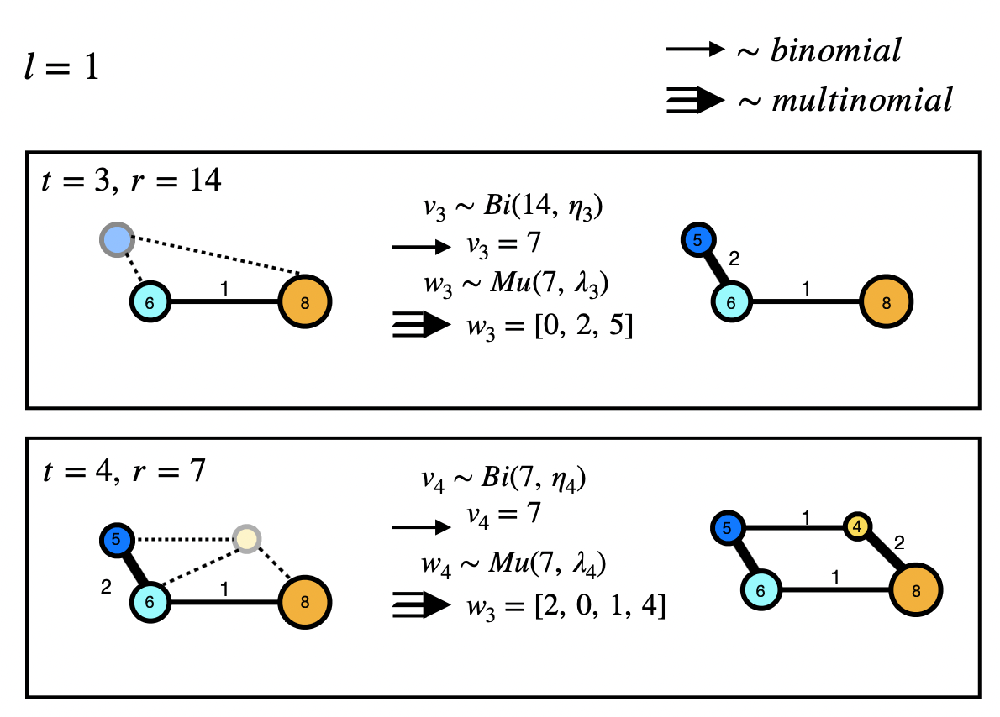

# HiGen: Hierarchical Graph Generative Networks
Official pytorch implementation for
**HiGen ([paper](https://arxiv.org/abs/2305.19337) )**

> **Abstract**
Most real-world graphs exhibit a hierarchical structure, which is often overlooked by existing graph generation methods.
To address this limitation, we propose a novel graph generative network that captures the hierarchical nature of graphs and successively generates the graph sub-structures in a coarse-to-fine fashion.
At each level of hierarchy, this model generates communities in parallel, followed by the prediction of cross-edges between communities using separate neural networks.
This modular approach enables scalable graph generation for large and complex graphs.
Moreover, we model the output distribution of edges in the hierarchical graph with a multinomial distribution and derive a recursive factorization for this distribution.
This enables us to generate  community graphs with integer-valued edge weights in an autoregressive manner.
Empirical studies demonstrate the effectiveness and scalability of our proposed generative model, achieving state-of-the-art performance in terms of graph quality across various benchmark datasets.

This implementation adapts and used the codes of the [GraphGPS model](https://github.com/rampasek/GraphGPS) in this work.
Additionally, the structure-based metrics from [GRAN](https://github.com/lrjconan/GRAN) and the GNN-based metrics from [GGM-metrics](https://github.com/uoguelph-mlrg/GGM-metrics) are employed for evaluating the generated graph samples.

## Usage
**TRAIN**
To train the model, simply run:
- ```python main.py -c configs/{conf}.yaml```

For more specific training, run the following scripts
- ```python main.py -c configs/higen_Enz.yaml --hp dist=mix_multinomial+PartBern,layer_type_gps=CustomGatedGCN+BiasedTransformer```

**Dataset Preprocessing**

To train on a new dataset, the code first needs to perform graph coarsening to create hierarchical graphs (HGs) from a raw graph dataset in NetworkX. The current version includes Spectral Clustering (SC). To use SC for coarsening, set `dataset.coarsening_alg=SC0` and `dataset.is_overwrite_precompute=true` in the yaml file.

## Dependencies
This package is mainly built upon:
`Python 3.8`, `PyTorch 1.13.1`, `torch-geometric 2.2`

Rest of  dependencies can be installed via

  ```pip install -r requirements.txt```

## Datasets
Datasets should be unzipped to directory: `data`

## Hierarchical Graph Generation

| |  | |
| :---: | :---: | :---: |
|  | | |

| |  |
| :---: | :---: |
|	|  |

## Cite
To cite this [paper](https://arxiv.org/abs/2305.19337):.

```
@article{karami2023higen,
  title={HiGen: Hierarchical Graph Generative Networks},
  author={Karami, Mahdi},
  journal={arXiv preprint arXiv:2305.19337},
  year={2023}
}

```

## Questions/Bugs
Please, submit a Github issue.
